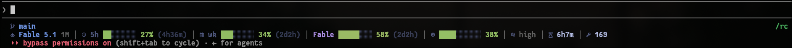
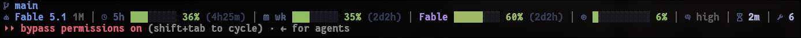

# claude-readout

A Nerd Font statusline for [Claude Code](https://claude.com/claude-code): model, rate-limit
meters, per-model weekly quotas, context, session time, tool calls and git, in truecolor, on
one line. Inspired by the HUD in [oh-my-claudecode](https://github.com/Yeachan-Heo/oh-my-claudecode).





- **Per-model weekly quotas.** Fable, and any tier Anthropic adds later, each with its own meter.
- **One static binary.** Written in Go. A frame renders in a few milliseconds and never
  touches the network. Only `--setup` and `--refresh-usage` go online.
- **Continuous meter colour.** Bars interpolate along a ramp, so 54% and 56% look like neighbours.

## Install

```sh
npm install -g claude-readout
claude-readout --setup
```

Restart Claude Code. The line appears.

`--setup` writes the binary's absolute path into `statusLine` in `~/.claude/settings.json`,
or `$CLAUDE_CONFIG_DIR/settings.json`, and leaves every other key alone. The path must be
absolute because Claude Code runs the statusline through a non-interactive shell without nvm,
fnm or volta on `PATH`. To edit the file yourself, use the path `claude-readout --doctor` prints:

```json
{ "statusLine": { "type": "command", "command": "/absolute/path/to/claude-readout" } }
```

`--setup` also looks for a [Nerd Font](https://www.nerdfonts.com/) in the platform font
directories. When none is found it downloads Symbols Nerd Font Mono from the nerd-fonts GitHub
release into the user font directory, on macOS and Linux. On Windows it prints the link and the
directory instead. That font holds only the icons, and terminals fall back to it for glyphs the
main font lacks, so the terminal font does not have to change. Check the icons with
`claude-readout --legend`. A box or a blank means the font lacks that glyph. Override single
glyphs in the config, or set `"glyphs": "text"` for plain labels.

<details>
<summary>Without npm</summary>

With Go 1.26 or newer:

```sh
go install github.com/VitorFOG/claude-readout@latest
claude-readout --setup
```

Or `go build` in a clone and run `./claude-readout --setup`. Either way `--setup` points Claude
Code at the binary that ran it.

</details>

## Elements

| Element | Shows | Source |
| --- | --- | --- |
| `model` | Model, with `1M` for the long-context variant | stdin |
| `fiveHour` | 5-hour window, time to reset | stdin |
| `weekly` | Weekly window, time to reset | stdin |
| `scoped` | Per-model weekly quota, printed as the model name | usage API |
| `context` | Context window used | stdin |
| `thinking` | Extended thinking, effort level | stdin |
| `session` | Session duration | stdin |
| `tools` | Tool calls this session | transcript |
| `cost` | Session spend in USD, off by default | stdin |
| `branch`, `gitStatus`, `repo` | Branch, working-tree counts, repository name (`repo` off by default) | `git` |

Everything except the per-model quota comes from the JSON Claude Code hands the statusline on
stdin. `claude-readout --legend` prints each element with its glyph.

## Configuration

Optional. `~/.config/claude-readout/config.json`, or the file `$READOUT_CONFIG` names. Every key
is an override.

```json
{
  "barWidth": 8,
  "elements": { "cost": true, "repo": true, "tools": false },
  "palette": {
    "accent": "#7aa2f7",
    "bar": [
      { "at": 0, "color": "#9ece6a" },
      { "at": 55, "color": "#9ece6a" },
      { "at": 80, "color": "#e0af68" },
      { "at": 100, "color": "#f7768e" }
    ]
  }
}
```

| Key | Default | What it does |
| --- | --- | --- |
| `elements` | `cost` and `repo` off, the rest on | Any element from the table above, `true` or `false`. |
| `palette.bar` | green to 55%, amber at 80%, red at 100% | A ramp of `{ "at", "color" }` stops; the colour interpolates between them. A plain array of hex strings spreads evenly over 0 to 100. |
| `palette.accent`, `muted`, `text`, `scoped`, `barEmpty`, `ok`, `warn`, `crit` | Tokyo Night | The other colours, as `#rrggbb`. |
| `glyphs` | Nerd Font set | `"text"` for plain labels, or an object overriding single glyphs. |
| `labels` | `"auto"` | `"auto"` names the quota meters (`5h`, `wk`, each model), which look alike side by side. `"always"` also names the context meter. `"never"` shows glyphs only. Model-scoped buckets always keep their name. |
| `names` | `5h`, `wk`, `ctx` | Rename `fiveHour`, `weekly`, `context`. |
| `barWidth`, `contextBarWidth` | 8, 10 | Meter widths in cells. |
| `showGitLine` | `true` | The git line above the meters. |
| `overflow` | `"shrink"` | What happens when the line is wider than the pane. See below. |
| `reserveColumns` | 2 | Cells held back for the pane border. |
| `separator` | `│` | Between elements. |
| `usageApi` | `true` | `false` skips the usage request. You keep the 5-hour and weekly meters and lose the per-model ones. |
| `usageTtlSeconds` | 120 | How old the usage snapshot may get before a refresh. |

**Narrow panes.** The line shrinks in steps before anything is cut. Reset times go first, then
bar width (8, 5, 3, none), then whole elements, least useful first. The quota meters are the
last thing standing. `"overflow": "wrap"` continues onto more lines instead of dropping
elements. `"none"` renders full width and lets Claude Code truncate. Width comes from `COLUMNS`,
the only signal a piped statusline gets. `READOUT_COLUMNS` overrides it for testing.

Colour follows [`NO_COLOR`](https://no-color.org/), and `--no-color` forces it off.

## How the per-model quota works

Claude Code's payload carries the 5-hour and weekly windows but not the per-model buckets. Those
come from `GET api.anthropic.com/api/oauth/usage`, read with the OAuth token Claude Code already
stores in `~/.claude/.credentials.json`, or the login Keychain on macOS. Each `weekly_scoped`
entry in the response becomes a meter labelled with its model name, so a new tier appears without
a release here.

The request never runs on the render path. Each frame reads a cached snapshot from
`~/.cache/claude-readout/usage.json`. When it is older than `usageTtlSeconds`, a detached
`--refresh-usage` process fetches a new one for the next frame. claude-readout never refreshes
the token. That is Claude Code's job, and an expired token only means no per-model bars until
Claude Code renews it.

## Troubleshooting

```sh
claude-readout --doctor          # binary, config and font paths, token, cache age, colour support
claude-readout --legend          # what each element means, and a font check
claude-readout --refresh-usage   # fetch usage now
claude-readout < testdata/fixture-session.json   # render a captured payload by hand
```

## Development

```sh
go test ./...              # unit tests and a CLI smoke test against the built binary
scripts/equivalence.sh     # diff the binary against the Node version it replaced
node scripts/build-npm.mjs # cross-compile every platform package into dist/npm
scripts/install-smoke.sh   # install those packages into a throwaway prefix and run them
```

The Go code is a port of the original Node implementation. `scripts/equivalence.sh` checks that
implementation out of git history and diffs the two over a matrix of payloads, configs, widths,
git states and flags. CI runs the tests, the harness and the install smoke on Linux and macOS.
A `v<version>` tag matching `package.json` publishes the six platform packages and the root.

The statusline contract: read JSON on stdin, print to stdout, always exit 0. A statusline that
fails leaves an empty pane, so every I/O path here shows less rather than failing.

## License

MIT
